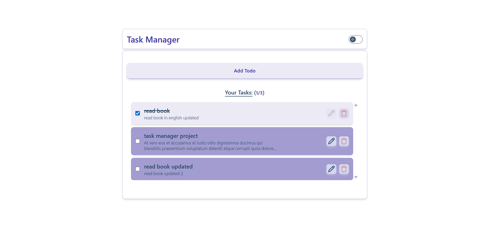
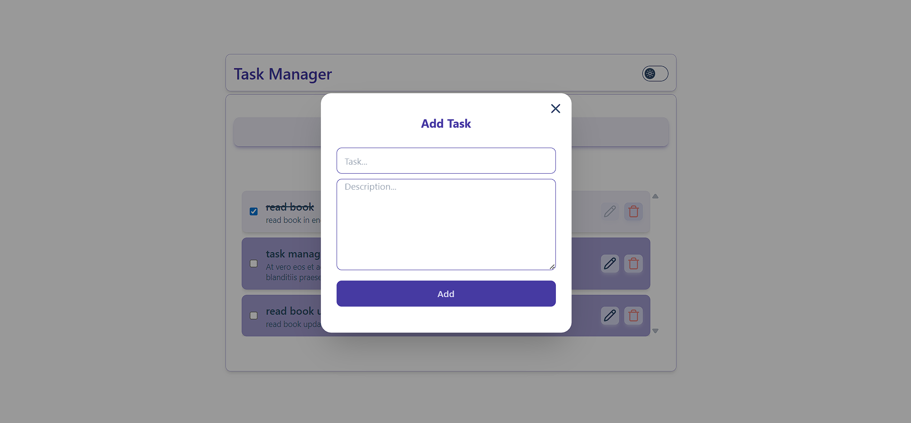
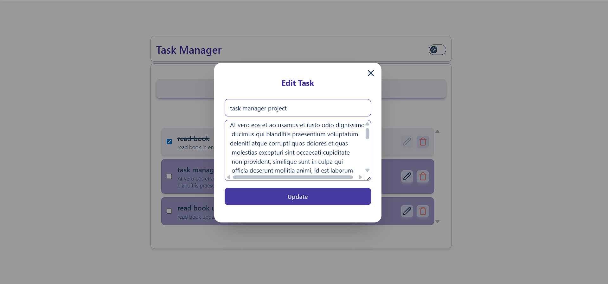
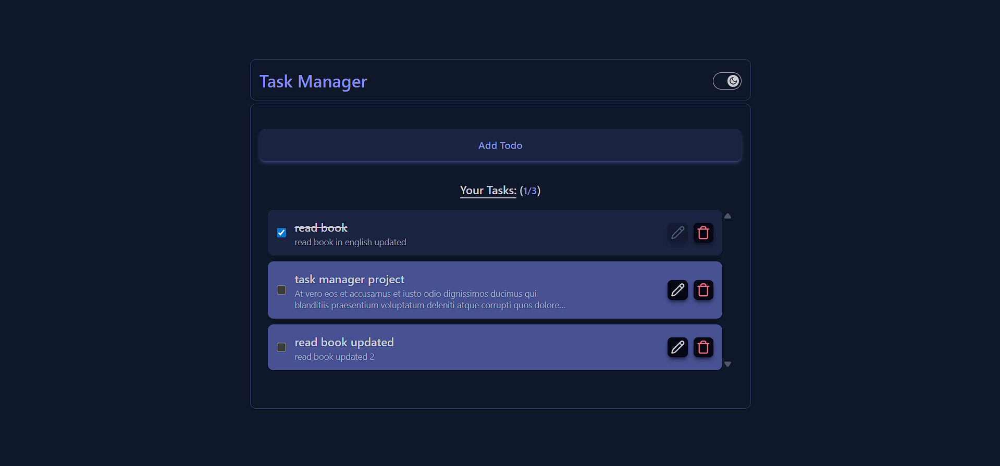
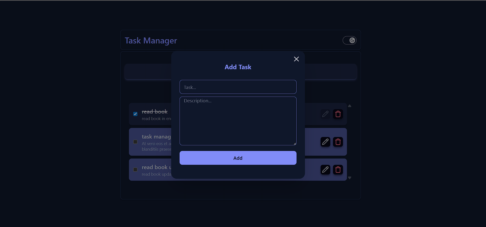
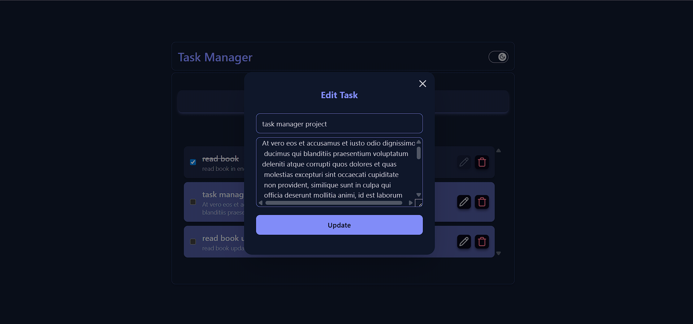

### Task Manager (React + Vite)

A simple and fast task manager to add, edit, complete, and delete tasks. Built with React, Vite, Tailwind CSS (with daisyUI), and React Hook Form + Zod for form validation. It stores your data and theme in the browser using localStorage.

---

### Features

- **Add tasks**: Create a task with a title and optional description.
- **Edit tasks**: Update title/description using a modal.
- **Mark complete**: Toggle completion with a checkbox.
- **Delete tasks**: Remove tasks you no longer need.
- **Light/Dark theme**: Switch between themes; your choice is saved.
- **Local persistence**: Tasks and theme are saved in localStorage.

---

### Screenshots

All screenshots are stored in `public/screenshots/`.

```md







```

---

### Getting Started

1. Install Node.js (LTS recommended).
2. Install dependencies:

```bash
npm install
```

3. Start the development server:

```bash
npm run dev
```

4. Open the app:

- Vite will show a local URL in the terminal (usually `http://localhost:5173`).

---

### Build for Production

```bash
npm run build
npm run preview
```

This creates a production build in the `dist` folder and serves it locally for preview.

---

### Project Structure

```text
src/
  components/        # UI components (Task, TaskList, Form, Modals, ThemeToggle)
  context/           # React Context for tasks and theme
  assets/            # Static assets
  main.jsx           # App entry
  App.jsx            # Root component
```

---

### Tech Stack

- **React 19** + **Vite 7**
- **Tailwind CSS 4** + **daisyUI**
- **React Hook Form** + **Zod** (form handling + validation)
- **lucide-react** (icons)

---

### Available Scripts

- **`npm run dev`**: Start the dev server
- **`npm run build`**: Build for production
- **`npm run preview`**: Preview the production build
- **`npm run lint`**: Run ESLint

---

### How Data Is Saved

- Tasks and theme are saved in the browser using `localStorage`.
- Data is kept only on your device. Clearing browser data will remove tasks.

---

### License

This project is provided for learning/demo purposes.

---

Made with ❤️ Sumit Tomar
